### 1. Generate Data

**Goal:** Create your own dataset (at least 300 records, mixed-length texts, include `en` for English, `ta` for Tamil, `hi` for Hindi, `fr` for French)

- How it works:
  - Use topics you like (eg: movie reviews, tech tips, quotes), make up sentences, or use open datasets as a base then edit them. In my case I'm taking indoor farming context.
  - Use google translate for some Hindi/Tamil/French content, or write your own formation.
  - Ensure a mix of 1-2 line and paragraph-length entries.
  - Structure: Each record has an (`id`, `chunk_id`, `lang`, `text`)

- Tip: You can use python or excel to prepare your data.

###2. Save in Formats

**Goal:** The same data should be saved as CSV, TXT, DOCX, PDF, and JSON.

- How it works:

    - Use `pandas.DataFrame` to export csv : `df.to_csv('data.csv', index=False)`

    - Write .txt `with open('data.txt', 'w', encoding='utf8') as f:`

    - Use `python-docx` for DOCX

    - Use PDF: `PyPDF2`

    - Use JSON: `df.to_json('data.json')`

### 3. Read & Clean

**Goal:** Create a loader for each format, clean the text.

- How it works:

    - For each format make a Python function to load data into a list/Dict.
        - CSV : `pandas.read_csv`
        - TXT : `readlines()` or separated by `\n\n`
        - DOCX: `python-docx`
        - PDF: `PyPDF2`
    
    - Deduplicate: remove repeated texts (eg: `set`)
    - Normalize: strip whitespace, standardize encoding, lowercase (as appropriate for language)
    - Detect language: Use `langdetect` (`from langdetect import detect`)
    - Chunk text: Break texts into chunks of 50 tokens `nltk`S `word_tokenize`.
    - Store processed data with `id`, `chunk_id`, `lang`, `text`.

### 4. Pipeline Script

**Goal:** Python script which: loads -> cleans -> chunks -> saves clean data

- **Structure:**
    1. Input: Folder `data/raw` with all format files.
    2. Script loads each format
    3. Deduplicate, normalize, language-detect, chunk, assign unique ids.
    4. Save all processed chunks in one file: `data/processed/clean.jsonl`

- **Code:**
    1. Write main pipeline in `main.py`

### 5. Embeddings & Index

**Goal:** Create embeddings with store in FAISS/Qdrant

- How it works:
    - Embedding Model: Custom embedding model used over here. `texttext-embedding-3-small` inverted by OpenAI.

    - Loads FAISS index from `dump.index`
    - Reads text metadata from `metadata.jsonl`
    - Embeddings the query string using custom `EURI embedding function`.
    - Searches FAISS for the `top=5` closest vectors.
    - Prints their corresponding original texts and similarity scores.

- Note:
   Before running, make sure:
    - `dump.faiss` is FAISS Index file
    - `metadata.jsonl` contains one record per line, matching the vector order in FAISS.

### 5. Compare cosine similarity vs inner product in FAISS

- How it works:
    - Loads FAISS Index and metadata.
    - Given a query, generates its embedding via custom API.
    - Compares retrieval with:
        1. `Cosine similarity:` Uses FAISS IndexFlatIP on normalized vectors.
        2. `Inner product:` Uses FAISS IndexFlatIP on non-normalized vectors.
    - Shows the top=5 results for each method.
    - At the end, explains which method typically retrieves more relevant results, and why?

    `Cosine similarity` is generally more relevant for text embeddings because it measure the angle (semantic similarity) between vectors and is invariant to vector magnitude.

    `Inner product` can be dominated by vector norms, potentially distorting relevance. When vector magnitudes vary. For sematic search, cosine similarity (i.e, normalized vectors + IP index) is preferred.

- Notes:

    - Save embedding matrix to `embeddings.npy` should be your array of shape `(n, d)` of all stored embeddings. You can save this using `np.save("embeddings.npy", embeddings)`along with the FAISS Index when processing your data for easy reload.

    - `metadata.jsonl` should have all original texts, one JSON per line, matching the embedding order.

    - If you only have the FAISS Index but not the vectors, you'll need to extract vectors from a separate source before you can re-index them for different similarity metrics.

    - You only need to normalize vectors and query for cosine similarity.

    - The model and API remain the same, Only retrieval logic switches.

**Output**

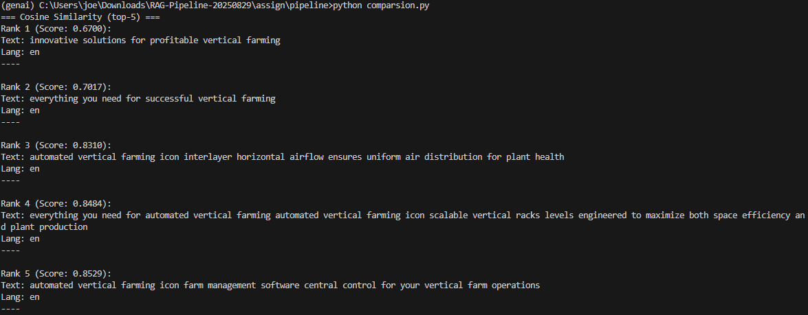

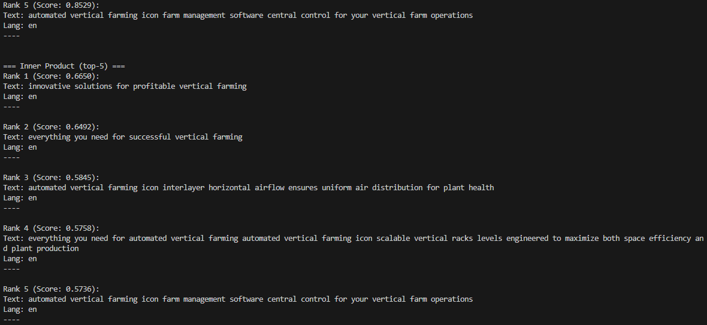

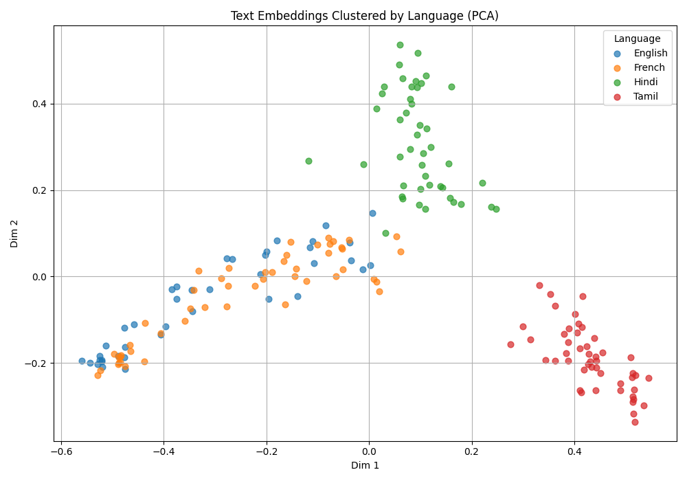

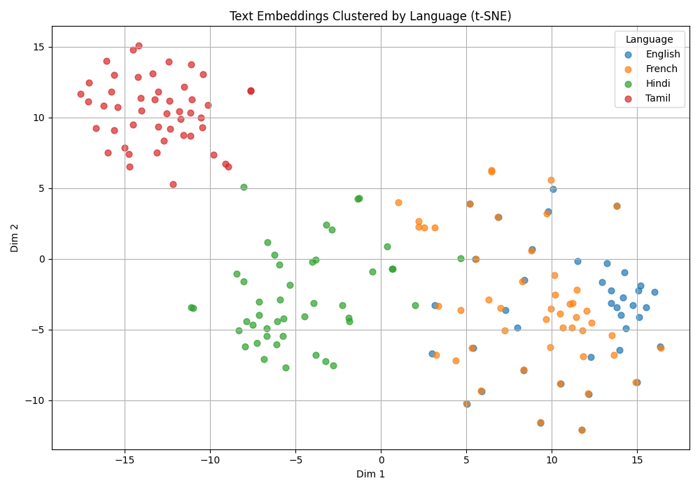

To build the small FAQ Chatbot : store in Qdrant embed queries and return the closest FAQ answer

**Output**
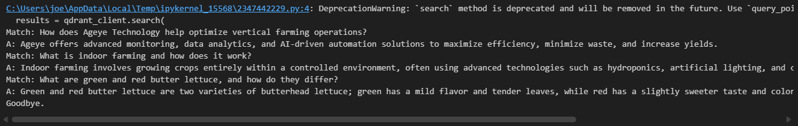

### To build a `plagiarism checker` : store essay in FAISS. For a new essay , check if similarity > threshold with existing ones.

**Output**
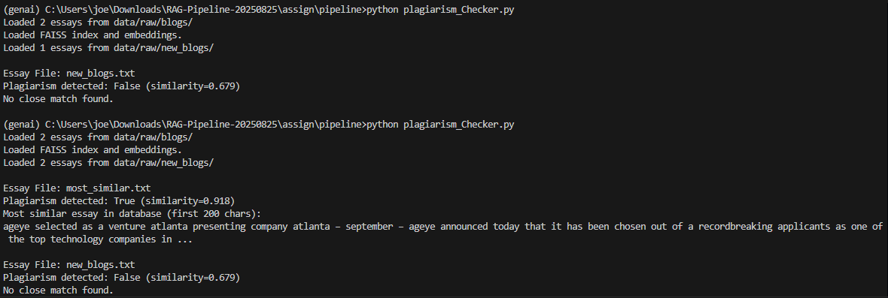

### To build the `news recommendation` prototype: store news articles, query for **AI breakthroughts**  and compare nearest result.

**Output**
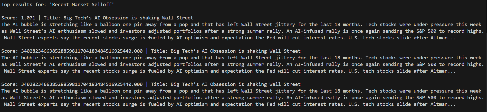

### To build the `job recommendation` : store resume embeddings and job descriptions. Write a function that returna the top-3 matching resumes for each job description.

**Output**
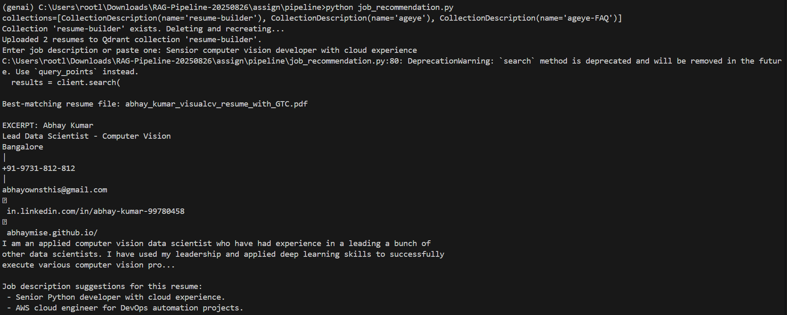

### To build the `multilingual embedding model`: store english documents, then query in Hindi. Compare recall vs query-translation approach.

**Output**
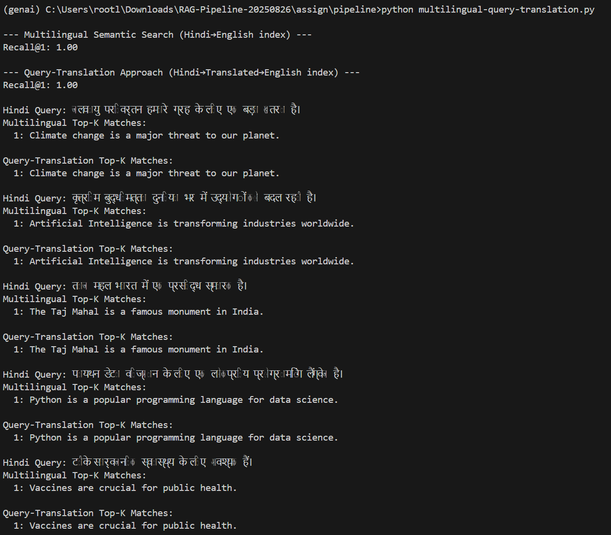

### To store embeddings of `Python code snippets` and retrieve code by natural language quries like binary search function.

**Output**

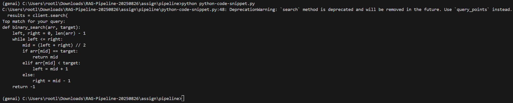

### To build a cross model search: store both image embeddings and text captions, then allow search by either text or image.

**Output**

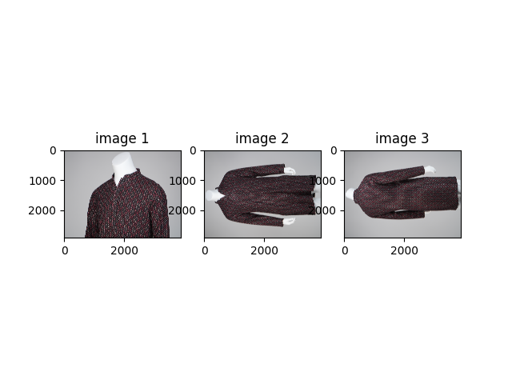

