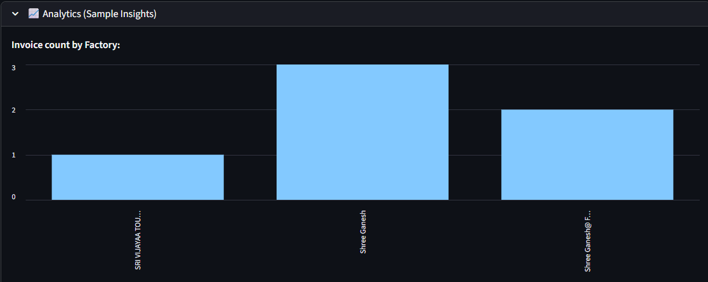

## 🧾 Invoice AI Extraction App

<font color=green>Objective:</font>
A Streamlit-powered, no-code, AI-assisted pipeline to extract key information from `invoice PDFs / Images` into a structure SQLite database, with OCR, analytics, and batch/folder automation.

---
## 🏁 Features

- Upload invoices as PDF or image (`.pdf`, `.jpg`, `.jpeg`, `.png`)
- OCR (optical character recognition) using `EasyOCR`
- **PDF support** via [Wand](https://docs.wand-py.org/) and [ImageMagick](https://imagemagick.org/)
- Data stored in local SQlite database (`invoices.sqlite`)
- View, search, and analyze all invoices in the app
- Batch processing via folder watcher

---
## 🚀 Installation

### 1. **Clone or Download This Repository**

```sh
git clone 
cd 
```

### <font color=green>2. Install Python Dependencies</font>
Create a virtual environment
```sh
python -m venv env
# Activate
# Windows
env\Scripts\activate
# macOS/Linux
source env/bin/activate
```

Install Python packages:
```sh
pip install -r requirements.txt

pip install streamlit pandas, easyocr wand pillow numpy
```

### <font color=green>3. Install Required System Libraries</font>
a. ImageMagick
 - Download and install the latest Q16 64-bit "static/dynamic" build for your system.
 - Make sure to check these boxes during install:
    - Add application directory to your system path
    - Install legacy utilities
    - Install development headers and libraries for C and C++

b. Ghostscript
- Download and install the latest 64-bit version.
- Ensure that the installation folder's `bin` eg: (`C:\Program Files\gs\gs10.03.0\bin`) is also in your system PATH.

🎯 Verifying Installation
- Open a new Command Prompt and type:
```sh
magick -version
gswin64c.exe -version
```
Both commands should print version numbers

### <font color=green>4. Run The APP</font>
```sh
streamlit run app.py
```

### <font color=green>5. Using the App</font>
- Upload a PDF or Image via the sidebar
- Batch Process: Place files in the `/invoice` folder in the project directory and clike `Process all` on the sidebar.
- View, filter, and analyze invoices and their extracted data.
- Each processed invoice is stored in a SQLite DB, including its full raw OCR and extracted data.

📂 Folder Structure
```sh
project-folder/
│
├─ app.py                  # Streamlit app
├─ pipeline.py             # All OCR/DB logic (if modularized)
├─ invoicesDB.sqlite       # Generated DB file
├─ invoice/                # Place invoices here for batch mode
├─ requirements.txt
└─ README.md
```

### <font color=green>Expected Input Examples</font>
1. PDF Invoice
  - File: `invoice/11023-GS-Design-Studio-Trichy.pdf`
  - Content: A scanned or digital invoice in PDF format.

 ```sh

 ```

2. Image Invoice
  - File: `invoice/invoice_0.png`
  - Content: A photographed or scanned image of an invoice, containing fields similar to above. The app supports `.jpg`, `.png`, `.jpeg`

### <font color=green>Expected Output Examples</font>
(After OCR and extraction, this is what's shown in the database / analytics UI and saved to SQLite.)

**1. Data Table / Analytics:**


**2. Raw JSON Extracted in DB:**
```sh
"raw_json":"{
  "factory": "SRI VIJAYAA TOUGHENED GLASS PVT LTD",
  "order_type": "FACTORY JOB",
  "proforma_no": "PI-11023",
  "date": "2025-08-28",
  "bill_to": "Ms GS Design Studio Trichy No 6-1, 4th Cross West, Thillainagar , Trichy Trichy 620018",
  "delivery_to": "Ms GS Design Studio Trichy No 6-1, 4th Cross West, Thillainagar , Trichy Trichy 620018",
  "place_of_supply": "Tamil Nadu",
  "state_code": "33",
  "gstin_no": "33AAUCS6872MIZE",
  "sales_reference": "8428151151",
  "terms_conditions": "Please Check the Sizes, Holes Cut out Etc., before Confirmation. Toughened Glasses are Tailor/Custom Made, Once Order Placed Cannot be Cancelled or Altered. Mode of Payment 100 % Advance Payment along with PO and Order Confirmation by IMPS /RTGS/NEFT. Sale is Ex Factory, Freight, Unloading & Insurance on Buyers Scope. Delivery 4 to 5 Working Days after the Date of Receipt of Payment. Validity of Quotation is against current stock or 2-3 days. Jumbo Size (5 Sq.mt & above) 15% extra. Claims restricted to processing quality; manufacturing defect subject to manufacturer’s acceptance. Packing in Wooden Case charged extra. 100% Transit Breakage risk at buyer's. Goods once delivered should be checked immediately. Interest on overdue balances @ 2% per month. Subject to Tiruchirapalli jurisdiction. E & O.E."
}"
```

**3. On Streamlit UI**

**Sidebar:**
  - Upload a new file: `invoice_5.png`
  - Select row: 1

 Main area (after pre-processing / upload)
 ```sh
 {
"id":1
"file_name":"invoice_5.png"
"factory":"SRI VIJAYAA TOUGHENED GLASS PVT LTD"
"order_type":"FACTORY JOB"
"proforma_no":"PI-11023"
"date":"2025-08-28"
"bill_to":"Ms GS Design Studio Trichy No 6-1, 4th Cross West, Thillainagar , Trichy Trichy 620018"
"delivery_to":"Ms GS Design Studio Trichy No 6-1, 4th Cross West, Thillainagar , Trichy Trichy 620018"
"place_of_supply":"Tamil Nadu"
"state_code":"33"
"gstin_no":"33AAUCS6872MIZE"
"sales_reference":"8428151151"
"terms_conditions":"Please Check the Sizes, Holes Cut out Etc., before Confirmation. Toughened Glasses are Tailor/Custom Made, Once Order Placed Cannot be Cancelled or Altered. Mode of Payment 100 % Advance Payment along with PO and Order Confirmation by IMPS /RTGS/NEFT. Sale is Ex Factory, Freight, Unloading & Insurance on Buyers Scope. Delivery 4 to 5 Working Days after the Date of Receipt of Payment. Validity of Quotation is against current stock or 2-3 days. Jumbo Size (5 Sq.mt & above) 15% extra. Claims restricted to processing quality; manufacturing defect subject to manufacturer’s acceptance. Packing in Wooden Case charged extra. 100% Transit Breakage risk at buyer's. Goods once delivered should be checked immediately. Interest on overdue balances @ 2% per month. Subject to Tiruchirapalli jurisdiction. E & O.E."
 }
 ```

**4. Analytics Panel**

  - Bar chart: Counts of factory, order_type etc.

 

 

 - Date range displayed for all invoices.
